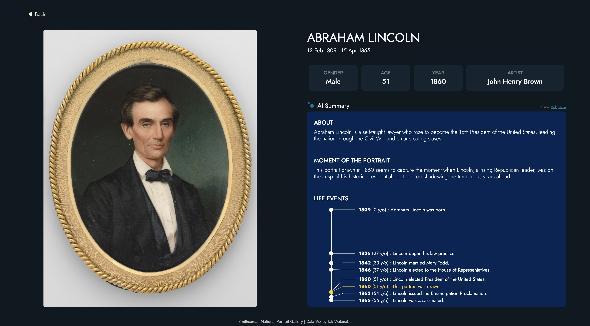
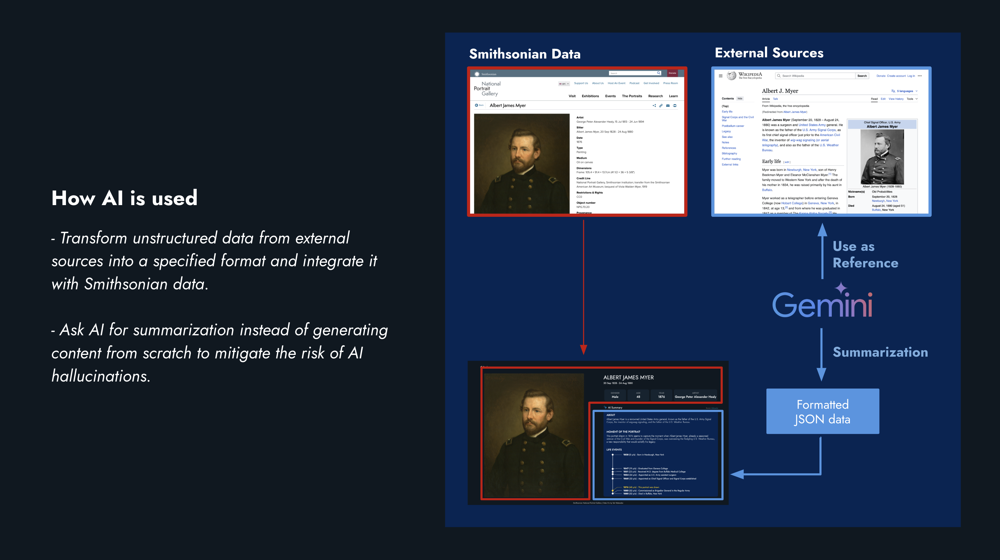
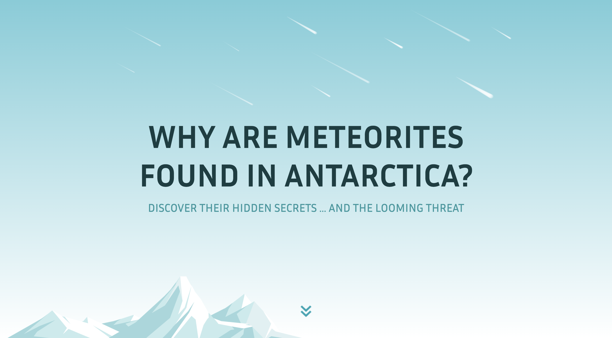
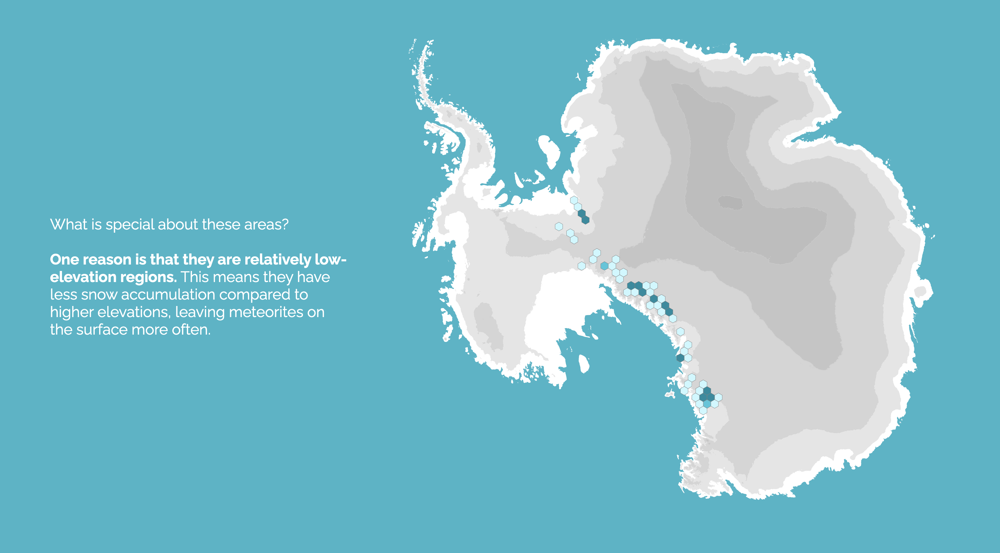

# Major Studio 1 Projects
This document is the final submission for my project, which I developed in collaboration with the Smithsonian Institution during the Major Studio 1 class in the Fall Semester of 2024, as part of the MS Data Visualization program at Parsons School of Design.

## 1. Uncover the moment
🔗 : https://takumanken.github.io/major-studio-1-code/qualitative_data/app/code/index.html 

This project aims to help viewers understand the background information for each portrait in the Smithsonian's portrait collection. Alongside the details provided through [Smithsonian Open Access](https://www.si.edu/openaccess), this visualization incorporates AI-generated summaries using [Gemini API](https://ai.google.dev/). These summaries include general information about the sitter and insights into what this moment in the sitter's life might have been like. To minimize the risk of AI hallucinations, the project adopts an approach where the AI summarizes external information instead of generating descriptions from scratch.

## 2. Why are meteorites found in Antarctica?
🔗 : https://takumanken.github.io/major-studio-1-code/interactive/code/app/index.html

Seventy-one percent of meteorites are collected from Antarctica. Why is this the case? While the harsh climate plays a role, the reasons are far more intriguing. This project delves into these factors through a scrolly-telling narrative, enhanced by map visualizations, photographs, and illustrations. This is the second iteration of my qualitative project, [Meteorites in Antarctica](https://takumanken.github.io/major-studio-1-code/quantitave_data/code/app/).

